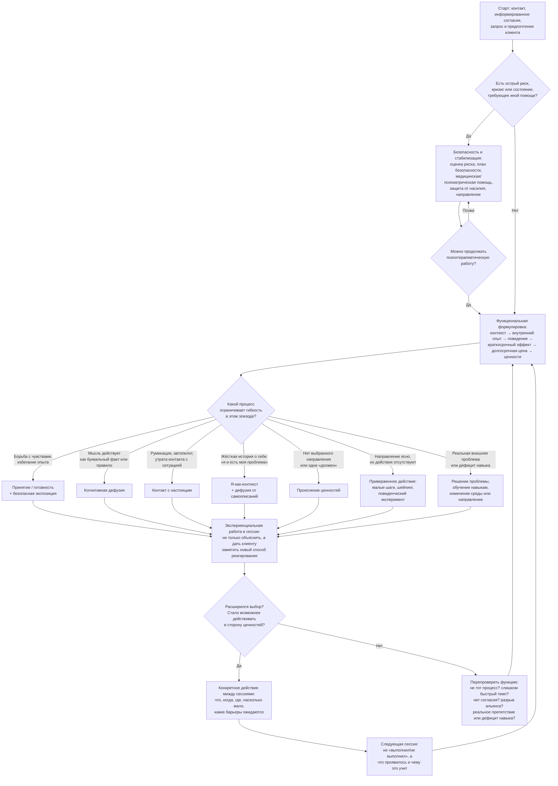

Ниже — не «официальный порядок шести процессов», а практическая карта принятия клинических решений. В ACT процессы выбираются по функции поведения клиента: что поддерживает проблему сейчас и какой процесс может расширить ценностно направленное действие.

## 1. Общий граф терапии

Главная петля ACT:

> ценность → действие → встреча с барьером → принятие/дефузия/присутствие → следующее действие → обобщение.

Необязательно сначала «освоить» все процессы. Часто небольшой ценностный шаг назначается уже после первой или второй сессии, а нужный процесс становится виден при столкновении с барьером.

## 2. Базовый алгоритм одной сессии

```mermaid
flowchart LR
    A["1. Контакт и безопасность"] --> B["2. Проверка изменений<br/>и предыдущего действия"]
    B --> C["3. Один конкретный<br/>недавний эпизод"]
    C --> D["4. Функциональная цепочка:<br/>что возникло → что сделал →<br/>мгновенный эффект → цена"]
    D --> E["5. Найти процесс,<br/>проявляющийся сейчас"]
    E --> F["6. Получить согласие<br/>на короткий эксперимент"]
    F --> G["7. Практика процесса<br/>прямо в сессии"]
    G --> H["8. Разбор:<br/>что изменилось в отношении<br/>к опыту и доступных действиях?"]
    H --> I["9. Малый ценностный шаг<br/>+ план встречи с барьерами"]
    I --> J["10. Обратная связь:<br/>что было полезно,<br/>что не сработало?"]
```

### Практические вопросы для функциональной цепочки

Вместо общего «расскажите о тревоге» выберите один эпизод:

1. «Где и когда это произошло?»
2. «Что вы заметили в теле, эмоциях, мыслях и воспоминаниях?»
3. «Что вы сделали сразу после этого?»
4. «Что это дало в ближайшие минуты или часы?»
5. «Какова цена такого способа через неделю, месяц, год?»
6. «От чего важного это вас удаляет?»
7. «Как бы вы хотели поступить в подобной ситуации, если бы могли выбирать свободнее?»

Это позволяет не ставить процесс по диагнозу. Два клиента с паникой могут нуждаться в разных интервенциях: у одного доминирует избегание ощущений, у другого — слияние с правилом «если я тревожусь, я опасен», у третьего — отсутствие навыков безопасного поведения.

## 3. Что обязательно, а что выбирается по показаниям

### Базовые компоненты почти любой ACT-терапии

- Проверка безопасности, границ компетенции и необходимости дополнительной помощи.
- Совместные цели и информированное согласие на экспериенциальный характер работы.
- Контекстуальная функциональная формулировка, а не только перечень симптомов.
- Определение того, что клиент хочет приблизить в жизни, а не только убрать.
- Практика нового реагирования в сессии, а не одно интеллектуальное объяснение.
- Конкретное действие вне сессии, согласованное с ценностями и возможностями клиента.
- Регулярная проверка функции: действительно ли интервенция расширяет поведение?
- Мониторинг результата, альянса, побочных эффектов и необходимости изменить план.
- Постепенное обобщение навыков на разные ситуации и подготовка к рецидивам старого паттерна.

### Компоненты, которые не обязаны быть отдельным этапом

- «Творческая безнадёжность» (*creative hopelessness*).
- Формальная медитация.
- Метафоры ACT.
- Отдельная сессия по Я-как-контексту.
- Экспозиция.
- Подробное заполнение матрицы или гексафлекса.
- Одинаковая последовательность шести процессов.
- Фиксированное число сессий.

Их выбирают, если они функционально нужны, приемлемы клиенту и действительно меняют поведение.

## 4. Селектор интервенции

| Что наблюдается | Что проверить | Вероятный фокус | Практическое действие |
|---|---|---|---|
| Клиент откладывает жизнь до исчезновения тревоги | Как избегание помогает немедленно и чего стоит позже? | Принятие и готовность | Контакт с ощущениями в переносимой дозе, затем малый шаг в важную ситуацию |
| «Если я думаю, что провалюсь, значит провал неизбежен» | Действует ли мысль как факт или команда? | Дефузия | «Я замечаю мысль…»; произнесение мысли; проверка, можно ли действовать при её наличии |
| Руминация и постоянные сценарии будущего | Доступна ли текущая ситуация и информация из неё? | Настоящий момент | Ориентирование на происходящее, описание ощущений и внешних событий без оценки |
| «Я тревожный человек, поэтому не способен руководить» | Самоописание стало фиксированной идентичностью? | Я-как-контекст + дефузия | Различить наблюдаемую историю о себе и перспективу, из которой она замечается |
| «Я должен стать успешным, иначе я никто» | Это выбранное направление или социальное правило? | Ценности | Исследовать, каким человеком клиент хочет быть в деятельности, а не какой статус получить |
| Клиент знает ценности, но ничего не меняется | Шаг слишком велик? Нет навыков? Есть избегание? | Приверженное действие | Уменьшить шаг, назначить время и контекст, отрепетировать, предусмотреть барьер |
| Клиент действует, но без необходимых навыков | Проблема в негибкости или человек действительно не умеет? | Навыки и изменение среды | Обучение коммуникации, планированию, решению проблем; при необходимости другая терапия |
| Избегание подкрепляется мгновенным облегчением | Осознаёт ли клиент долгосрочную цену? | Работоспособность + ценности | Сравнить короткий выигрыш и цену; провести небольшой поведенческий эксперимент |
| Клиент всё понимает, но ничего не меняется | Не стало ли понимание ещё одной формой избегания? | Экспериенциальная работа | Меньше объяснять, вызвать паттерн в сессии и потренировать альтернативный ответ |
| Интервенция формально выполнена, но клиент старается «правильно принять» | Не стала ли техника новым способом контроля? | Функциональная перепроверка | Сместить критерий с уменьшения симптома на расширение выбора и действия |

## 5. Пример гибкого курса на восемь сессий

Это учебный каркас, а не нормативный протокол. Сессии можно объединять, повторять или расширять.

### Сессия 1 — рамка и функциональный снимок

- Риск, анамнез, контекст, диагнозы и параллельная помощь.
- Запрос переводится в наблюдаемое поведение.
- Выясняется, что клиент уже пробовал и как это работает кратко- и долгосрочно.
- Намечаются ценностные направления.
- Выбирается один очень небольшой шаг до следующей встречи.

### Сессия 2 — общая формулировка

- Разбирается конкретный эпизод.
- Рисуется петля: неприятный опыт → стратегия контроля/избегания → облегчение → цена.
- Обсуждается работоспособность стратегии, без попытки доказать клиенту, что она «неправильная».
- Если клиент пока не видит цены борьбы, возможны дневник или поведенческий эксперимент.

### Сессия 3 — дефузия и контакт с настоящим

- Выбирается повторяющаяся мысль или правило.
- Проводится короткая практика дефузии.
- Проверяется не «исчезла ли мысль», а появилось ли больше пространства для выбора.
- Практика связывается с конкретной ситуацией вне кабинета.

### Сессия 4 — принятие и готовность

- Уточняется, какой опыт клиент старается не чувствовать.
- Различаются добровольная открытость опыту и терпение опасной внешней ситуации.
- Возможна дозированная экспозиция к безопасным внутренним ощущениям или ситуациям.
- Готовность всегда привязывается к тому, ради чего клиент идёт навстречу дискомфорту.

### Сессия 5 — адаптивная развилка

- При жёсткой истории о себе — Я-как-контекст.
- При руминации и диссоциации — контакт с настоящим и осторожное заземление.
- При дефиците навыков — непосредственное обучение и репетиция.
- Если отдельный процесс не нужен, продолжается работа с основным паттерном.

### Сессия 6 — углубление ценностей

- Ценности отделяются от целей, обязанностей и желания понравиться терапевту.
- Выбираются одна-две области жизни, а не полный «идеальный жизненный план».
- Ценность переводится в наблюдаемые качества действия.
- Формируются кратко-, средне- и долгосрочные цели.

### Сессия 7 — расширение приверженного действия

- Анализируются результаты предыдущих экспериментов.
- Действия постепенно увеличиваются.
- Отрабатываются реальные навыки и изменение среды.
- Появляющиеся барьеры снова обрабатываются через принятие, дефузию и присутствие.

### Сессия 8 — консолидация

- Клиент формулирует собственную модель паттерна.
- Составляется план распознавания старой петли.
- Определяются ранние сигналы, поддержка, следующие действия и критерии обращения за помощью.
- Совместно решается: завершать, увеличивать интервалы или продолжать работу над новой мишенью.

Для ACT-D американская VA указывает типичный диапазон 10–16 индивидуальных сессий с адаптацией под предпочтения и приоритеты клиента; это пример длительности конкретного протокола для депрессии, а не универсальная норма ACT.

## 6. Важные клинические развилки

### Если есть депрессивная инерция

Не следует ждать появления мотивации. Начните с очень малых ценностных действий и поведенческой активации; принятие и дефузия подключаются к тем переживаниям, которые препятствуют действию.

### Если преобладает тревога, паника или фобическое избегание

Принятие и дефузия используются в поддержку приближения и экспозиции. Если упражнение становится способом гарантированно успокоиться, оно может превратиться в новое защитное поведение.

### Если присутствует травматический опыт или диссоциация

Нужны согласие, дозирование, проверка окна переносимости и достаточная ориентация в настоящем. Не следует автоматически вызывать интенсивный материал под лозунгом принятия; при необходимости используется специализированное лечение травмы.

### Если проблема связана с насилием или реальной опасностью

Приоритет — безопасность, поддержка и изменение внешних условий. Принятие относится к внутреннему опыту, а не к обязанности терпеть насилие.

### Если присутствует хроническая боль или заболевание

Разделяйте необходимое лечение, разумное распределение нагрузки и бесплодную борьбу с внутренним опытом. ACT не заменяет медицинскую диагностику.

### Если клиент пришёл под внешним давлением

Сначала проясните, есть ли собственные цели клиента. Нельзя превращать ценности в способ заставить человека соответствовать требованиям семьи, работодателя или терапевта.

## 7. Критерий выбора процесса

Не спрашивайте только: «Какой симптом у клиента?» Лучше спрашивать:

> Что человек делает, когда возникает этот опыт? Как это работает немедленно? Какова долгосрочная цена? Какой новый способ реагирования расширил бы выбор в сторону самостоятельно выбранных ценностей?

Источниковая основа схемы:

- [ACBS — Six Core Processes of ACT](https://contextualscience.org/six_core_processes_act)
- [ACBS — ACT Case Formulation Framework](https://contextualscience.org/book/export/html/74), разделы *Assessment and Treatment Decision Tree* и *Building interventions into life change and transformation strategy*
- [VA — Evidence-Based Treatment: ACT for Depression](https://www.mentalhealth.va.gov/get-help/treatment/ebt.asp), раздел *Acceptance and Commitment Therapy for Depression*

ACBS отдельно предупреждает, что размещённые на странице схемы концептуализации являются ресурсами сообщества, а не единым официально утверждённым протоколом.
